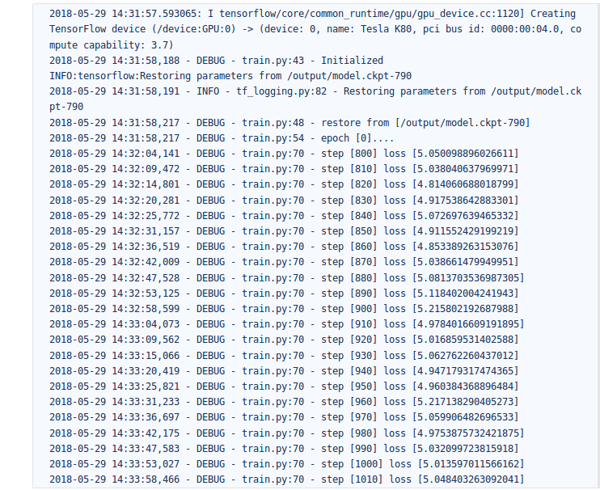
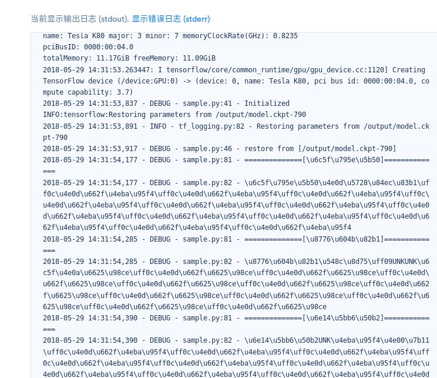

# zs-week11-604486216

Embedding部分：
	生成的json文件为:

		dictionary.json
                reverse_dictionary.json
        对应输出的图片为 tsne.png
   [!tsne](tsne.png)

 

RNN部分:
	train.py 
	utils.py 
	model.py 	

 输出结果不理想，乱码。。
 
 
